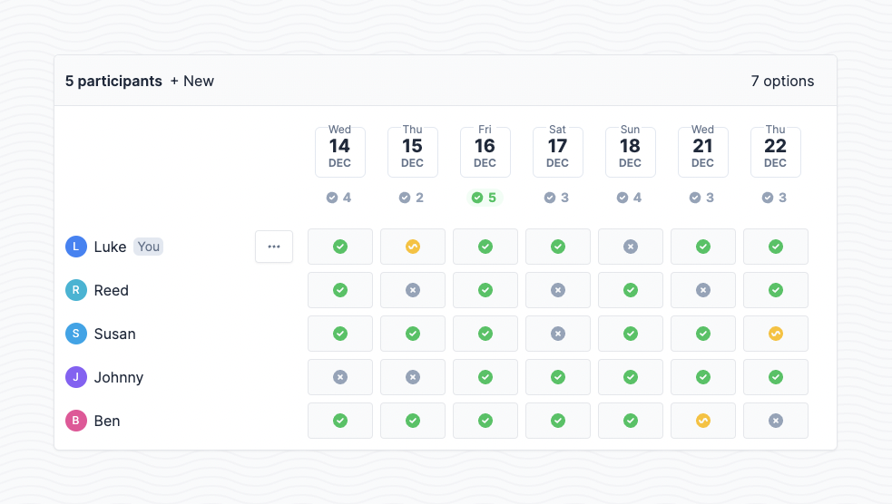

# Rallly CI/CD pipeline

Deploy Rallly server with CI/CD on Elestio

 
 

# Once deployed ...

You will need to register, then, once done, you will receive a code by email to complete the registration.
If you don't receive it, check your spam.
